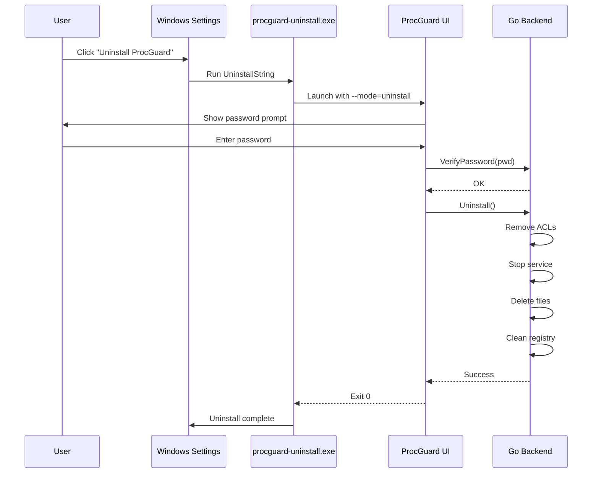

# Uninstall Protection System

## Overview
Prevent unauthorized uninstallation of ProcGuard. Only allow removal via the built-in password-protected uninstall menu in the UI.

## Current Vulnerability
- User can uninstall via Windows Settings → Apps
- User can run `wails-app.exe --uninstall` from command line
- User can delete files manually
- User can use third-party uninstallers (CCleaner, Revo)

## Goals
1. **Block Windows Uninstaller**: Prevent uninstall via Settings app
2. **Protect Uninstall Script**: Require password for uninstall process
3. **File Deletion Protection**: Lock critical files against deletion
4. **Registry Protection**: Prevent removal of uninstall entry

## Technical Approach

### 1. Custom Uninstall Handler
**WinAPI Required:**
- `RegSetValueExW` - Modify uninstall registry
- `ShellExecuteW` - Launch custom uninstall UI

**Current Registry (Problem):**
```
HKLM\SOFTWARE\Microsoft\Windows\CurrentVersion\Uninstall\ProcGuard
  UninstallString = "C:\Path\wails-app.exe" --uninstall
```

**Protected Registry (Solution):**
```
HKLM\SOFTWARE\Microsoft\Windows\CurrentVersion\Uninstall\ProcGuard
  UninstallString = "C:\Path\procguard-uninstall.exe"
  NoModify = 1 (DWORD)
  NoRepair = 1 (DWORD)
```

### 2. Uninstall Wrapper Executable
**Architecture:**
```
procguard-uninstall.exe (C/Zig + CGO)
  ├─> Launches ProcGuard UI with /uninstall flag
  ├─> UI shows password prompt
  ├─> On correct password: Calls backend Uninstall()
  └─> Backend verifies password, performs cleanup
```

**WinAPI Required:**
- `CreateProcessW` - Launch UI with elevated privileges
- `WaitForSingleObject` - Wait for UI confirmation

**CGO Implementation:**
```c
// procguard-uninstall.exe
int main() {
    STARTUPINFOW si = {0};
    PROCESS_INFORMATION pi = {0};
    
    WCHAR cmdLine[] = L"C:\\Program Files\\ProcGuard\\wails-app.exe --mode=uninstall";
    
    if (!CreateProcessW(NULL, cmdLine, NULL, NULL, FALSE, 0, NULL, NULL, &si, &pi)) {
        MessageBoxW(NULL, L"Failed to launch uninstall wizard", L"Error", MB_OK | MB_ICONERROR);
        return 1;
    }
    
    WaitForSingleObject(pi.hProcess, INFINITE);
    
    DWORD exitCode;
    GetExitCodeProcess(pi.hProcess, &exitCode);
    
    if (exitCode != 0) {
        MessageBoxW(NULL, L"Uninstall cancelled or failed", L"ProcGuard", MB_OK);
    }
    
    CloseHandle(pi.hProcess);
    CloseHandle(pi.hThread);
    return exitCode;
}
```

### 3. File Deletion Protection
**WinAPI Required:**
- `SetFileSecurityW` - Deny DELETE permission
- `GetNamedSecurityInfoW` + `SetNamedSecurityInfoW` - Modify ACLs

**Protected Files:**
```
C:\Program Files\ProcGuard\wails-app.exe
C:\Program Files\ProcGuard\procguard-uninstall.exe
C:\Program Files\ProcGuard\procguard.db
```

**ACL Configuration:**
```
Owner: SYSTEM
Permissions:
  - SYSTEM: FULL_CONTROL
  - Administrators: READ + EXECUTE (NO DELETE, NO WRITE_DAC)
  - Users: READ + EXECUTE
```

**CGO Implementation:**
```c
#include <aclapi.h>

DWORD ProtectFile(LPCWSTR filePath) {
    PSID pSIDAdmin, pSISTEM;
    PACL pACL = NULL;
    EXPLICIT_ACCESS ea[2];
    
    // Create SIDs for Administrators and SYSTEM
    SID_IDENTIFIER_AUTHORITY SIDAuthNT = SECURITY_NT_AUTHORITY;
    AllocateAndInitializeSid(&SIDAuthNT, 2,
        SECURITY_BUILTIN_DOMAIN_RID,
        DOMAIN_ALIAS_RID_ADMINS,
        0, 0, 0, 0, 0, 0, &pSIDAdmin);
    
    // Deny DELETE to Administrators
    ZeroMemory(&ea, 2 * sizeof(EXPLICIT_ACCESS));
    ea[0].grfAccessPermissions = DELETE | WRITE_DAC;
    ea[0].grfAccessMode = DENY_ACCESS;
    ea[0].grfInheritance = NO_INHERITANCE;
    ea[0].Trustee.TrusteeForm = TRUSTEE_IS_SID;
    ea[0].Trustee.ptstrName = (LPTSTR)pSIDAdmin;
    
    SetEntriesInAcl(1, ea, NULL, &pACL);
    SetNamedSecurityInfoW(filePath, SE_FILE_OBJECT, 
                          DACL_SECURITY_INFORMATION, NULL, NULL, pACL, NULL);
    
    LocalFree(pACL);
    FreeSid(pSIDAdmin);
    return ERROR_SUCCESS;
}
```

### 4. Registry Key Protection
**WinAPI Required:**
- `RegSetKeySecurity` - Lock uninstall registry key
- `RegGetKeySecurity` + `RegSetKeySecurity` - Modify DACL

**Protected Key:**
```
HKLM\SOFTWARE\Microsoft\Windows\CurrentVersion\Uninstall\ProcGuard
```

**Permissions:**
- SYSTEM: Full Control
- Administrators: Read Only (NO DELETE)
- Users: Read Only

### 5. Service Integration
**WinAPI Required:**
- `CreateServiceW` - Install as Windows Service
- `ChangeServiceConfig2W` - Set failure actions (restart on crash)

**Service Protection:**
- Service cannot be stopped except by uninstall process
- Service monitors for manual file deletion attempts
- Service resurrection if killed

## Implementation Phases

### Phase 1: Custom Uninstall Wrapper (CGO Required)
**Timeline:** 2-3 days
- [ ] Create `procguard-uninstall.exe` in C
- [ ] Launch main UI with `--mode=uninstall` flag
- [ ] Update registry `UninstallString`
- [ ] Test via Windows Settings → Uninstall

### Phase 2: Password-Protected Uninstall (Pure Go)
**Timeline:** 1-2 days
- [ ] Add `/uninstall` mode to main app
- [ ] Show password prompt modal
- [ ] Verify password via backend
- [ ] Call `App.Uninstall()` on success

### Phase 3: File ACL Protection (CGO Required)
**Timeline:** 3-4 days
- [ ] Implement `ProtectFile()` wrapper
- [ ] Deny DELETE to all users (except uninstall process)
- [ ] Test manual deletion attempts

### Phase 4: Registry Protection (CGO Required)
**Timeline:** 2-3 days
- [ ] Lock uninstall registry key
- [ ] Verify third-party uninstallers fail gracefully

### Phase 5: Service Watchdog (Pure Go + CGO)
**Timeline:** 4-5 days
- [ ] Convert to Windows Service
- [ ] Monitor for tampering attempts
- [ ] Alert parent on unauthorized uninstall attempts

## Uninstall Flow (Authorized)



## Bypass Mitigation

### Safe Mode Bypass
**Problem:** User boots to Safe Mode, deletes files manually
**Solution:**
- Service runs in Safe Mode (`SERVICE_BOOT_START`)
- Files still protected by ACLs
- Parent receives email alert if Safe Mode boot detected

### Third-Party Uninstaller Bypass
**Problem:** Tools like Revo Uninstaller forcefully remove software
**Solution:**
- Revo will fail due to ACL protection
- Parent receives tampering alert
- Option to re-lock files if detected as unlocked

### Registry Deletion Bypass
**Problem:** Advanced users use `regedit` to delete keys
**Solution:**
- Service monitors registry via `RegNotifyChangeKeyValue`
- Immediate restoration of deleted keys
- Tamper event logged

## CGO + Zig Benefits

### Why CGO is Needed:
1. **ACL Manipulation**: `SetNamedSecurityInfo` has complex struct parameters
2. **Process Creation**: Need synchronous wait for UI confirmation
3. **Service Management**: `CreateServiceW` is Windows-specific

### Zig Advantages:
- Static linking of `advapi32.lib` for ACL functions
- Cross-compile wrapper from Linux/Mac
- Better struct handling for `EXPLICIT_ACCESS`

## Testing Plan

### Test Cases:
1. **Windows Settings Uninstall**: Verify password prompt appears
2. **Wrong Password**: Verify uninstall aborts
3. **Correct Password**: Verify clean uninstall
4. **Manual Deletion**: Verify files cannot be deleted
5. **Revo Uninstaller**: Verify failure with clear error
6. **Safe Mode**: Verify service still protects files

### Success Metrics:
- [ ] Windows uninstaller launches password prompt 100% of time
- [ ] Manual file deletion fails with "Access Denied"
- [ ] Revo Uninstaller fails gracefully
- [ ] Authorized uninstall completes successfully
- [ ] No orphaned files/registry keys after uninstall

## Ethical Considerations
- **Transparency**: Clearly document uninstall process
- **Emergency Access**: Provide Safe Mode recovery instructions
- **Support Contact**: Help parents who forget password

## Future Enhancements
- **Email Confirmation**: Parent receives email before uninstall completes
- **Two-Factor Uninstall**: Require parent's phone verification
- **Cloud Backup**: Auto-backup settings before uninstallation (for re-install)
